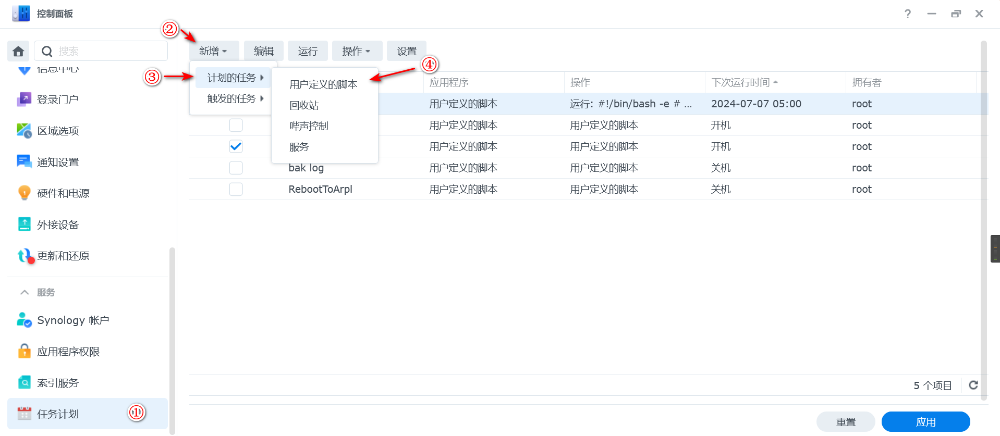
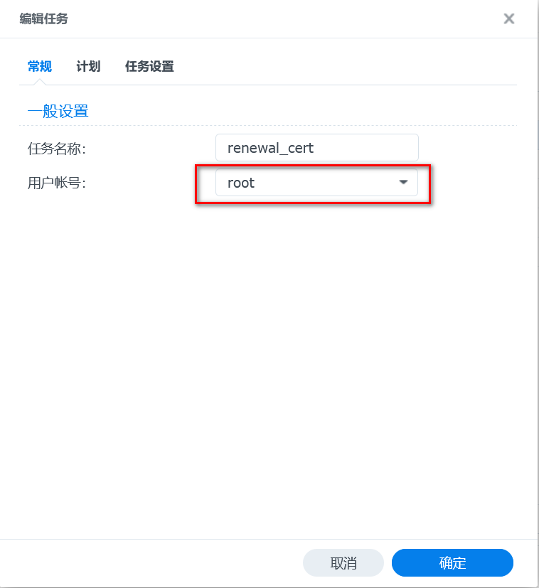
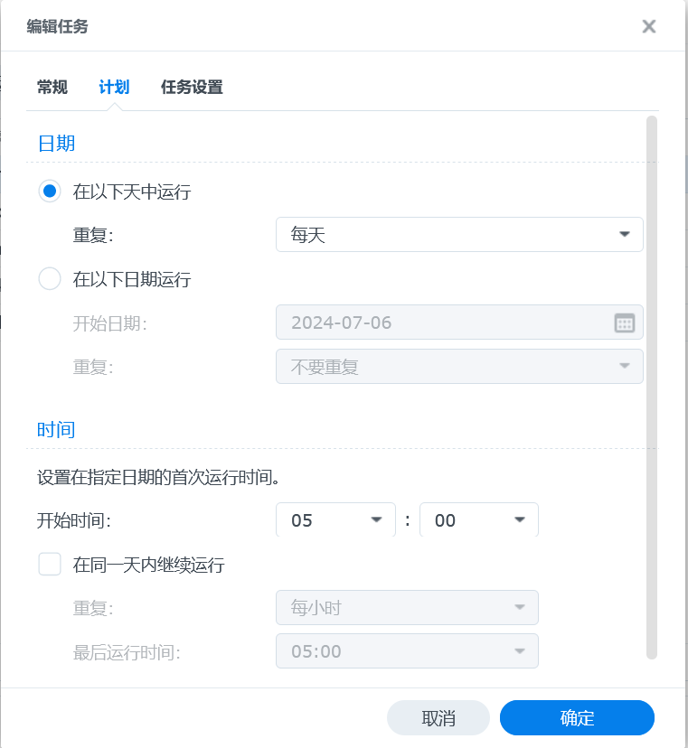
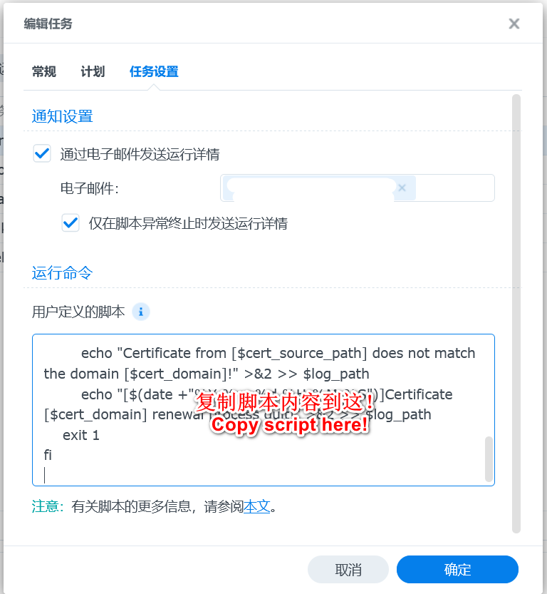
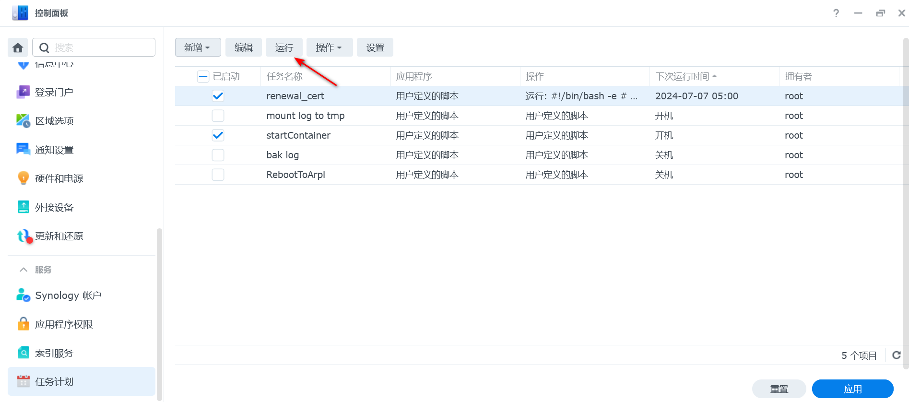
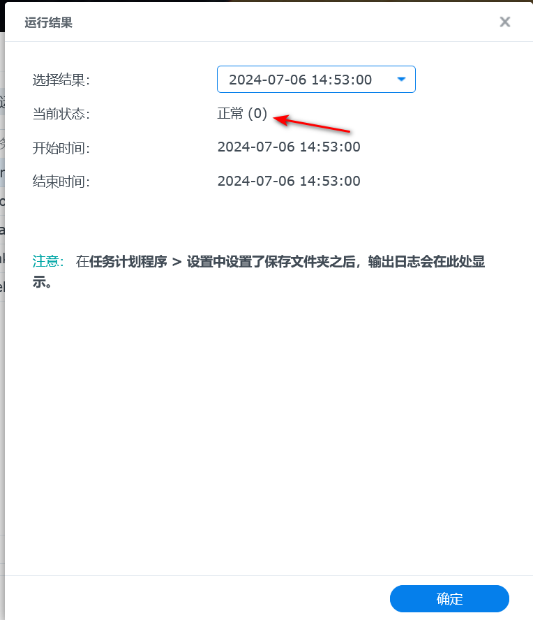
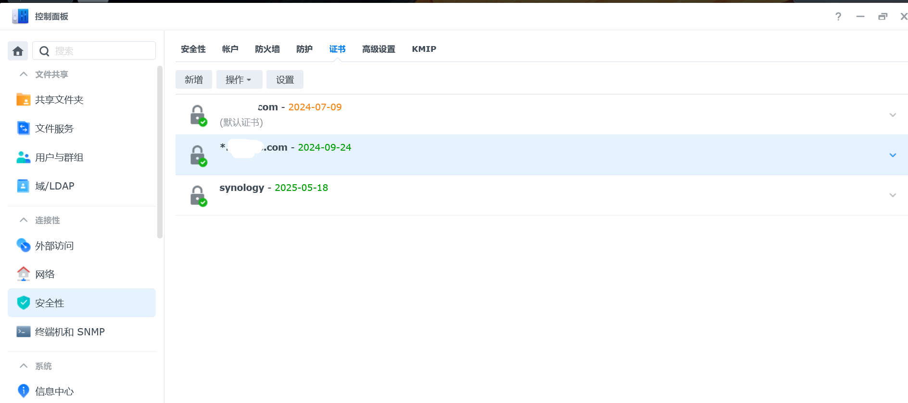

# syno_cert_renewal_shell
基于群晖计划任务定期执行此脚本，根据指定目录证书文件自动更新群晖证书

## 如何使用
### 更改Syno_cert_renewal_base_local_dir.sh参数
#### 必填参数
```
# 泛域名如*.a.com填写a.com即可
cert_domain="a.com"
# ftp/nfs等定期上传更新证书的目录
cert_source_path="/volume1/homes/certd/_a_com"
```
#### 可选参数
```
# 最好要指定默认证书文件名称，这样就能并行使用多个脚本
cert_id_default=""
# 默认保存cert_id的文件名
cert_id_default_file="./cert_id_default"
```
### 群晖Syno设置
#### 根据cert_source_path新建对应的目录
**/volume1/homes/certd**是certd的home目录。

#### 上传证书到cert_source_path
- 上传```fullchain.pem```到```/volume1/homes/certd/_a_com/```下
- 上传```privkey.pem```到```/volume1/homes/certd/_a_com/```下
- 
#### 添加任务计划
1.  创建**用户定义的脚本**：控制面板->任务计划->新增->计划的任务->用户定义的脚本;

   

2.  设置**常规**：
   2.1 任务名称：英文/数字
   2.2 用户账户：**root**

   

3. 设置**计划**：根据自己需要设置定期执行的时间；

   

4.  设置**任务设置**：
   将**Syno_cert_renewal_base_local_dir.sh**修改好配置的参数后的代码复制进**用户命令**文本框内，保存；

   

#### 试运行及检查结果
##### 试运行任务计划


##### 检查运行结果
- 查看日志：
根据设置的**log_path**，查看日志内最后一行是否包含**Certificate [hostname] renewal process done!**类似字样。

- 群晖界面查看结果：
  任务计划->选择你创建的任务->操作->查看结果，如果显示如下状态则运行正常：

  

  

##### 查看证书生效情况



#### 注意事项
此脚本理论支持Syno 6.x和7.x，但仅在7.2使用过，其他的请自己尝试。
